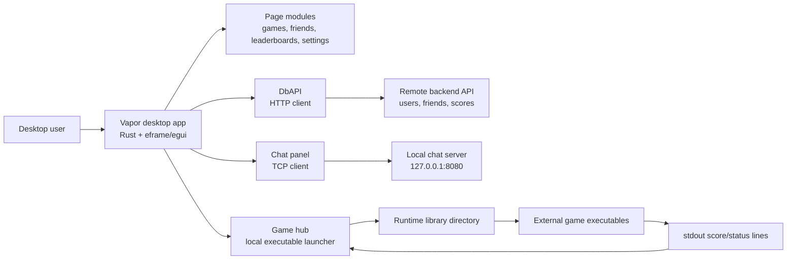
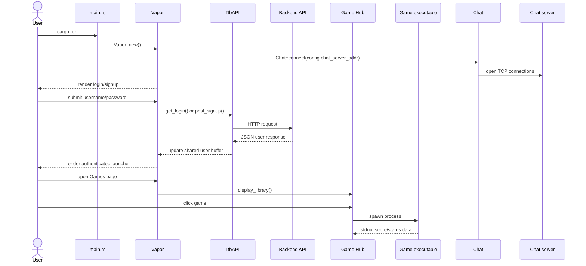
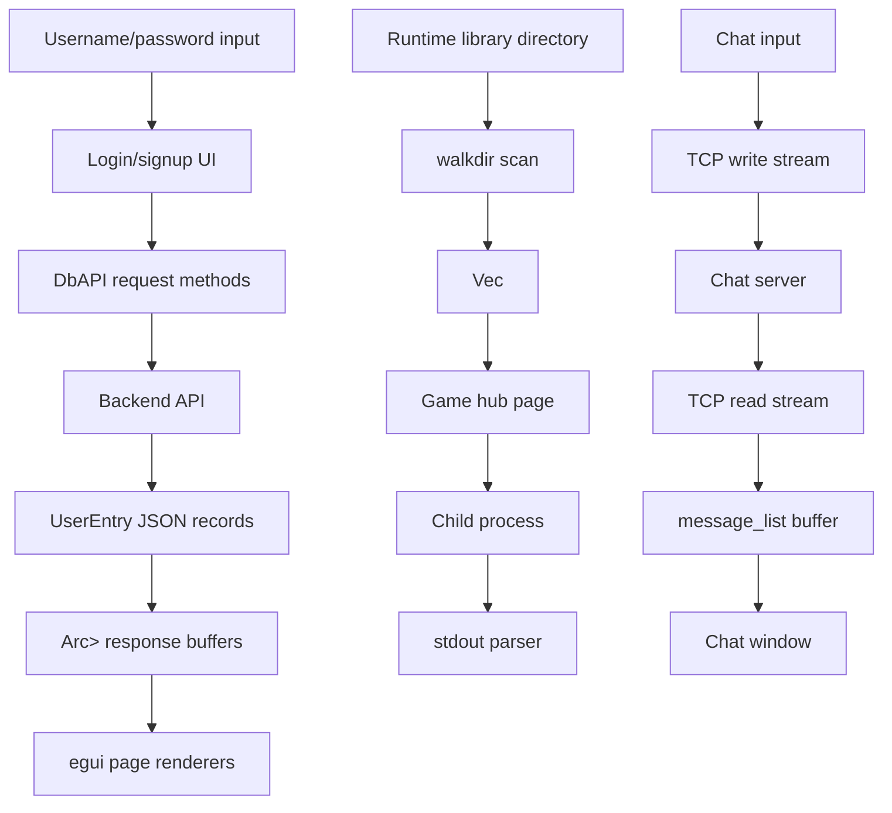
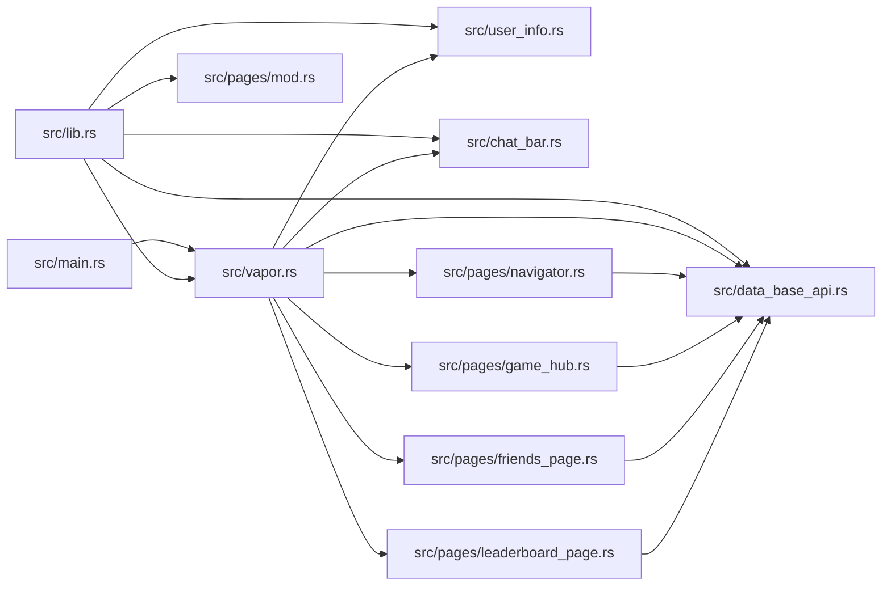
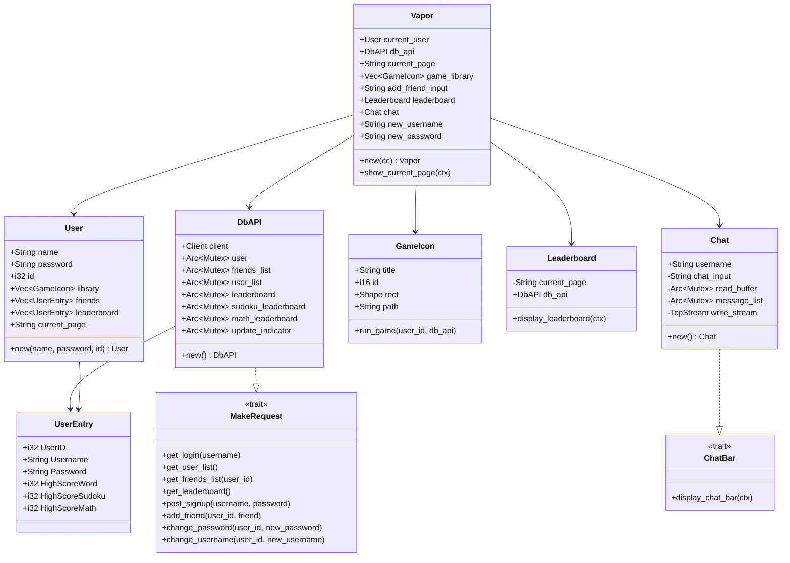
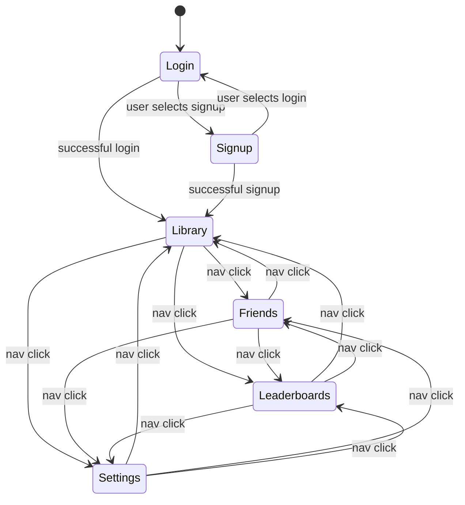

# UML and Diagrams

This document contains Mermaid diagrams that GitHub can render directly. The diagrams describe the current launcher architecture, runtime workflow, data movement, and main object relationships.

## High-Level System Architecture

## Main Workflow Sequence

## Data Flow Diagram

## Module Dependency Diagram

## Class/Object Model

## Page Routing State

